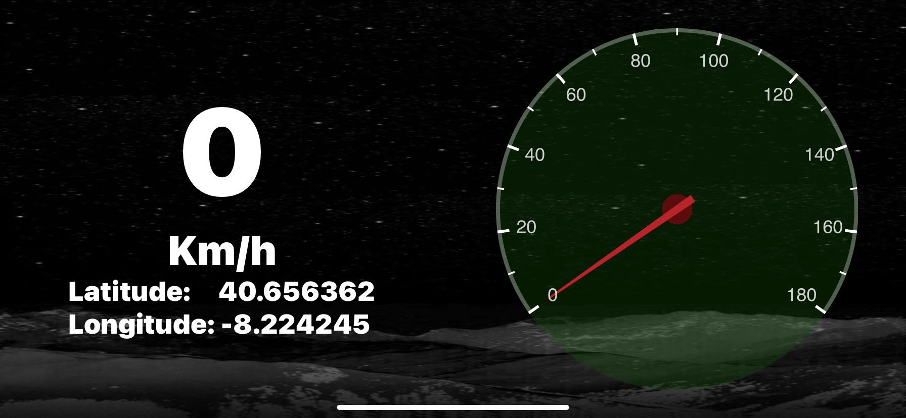
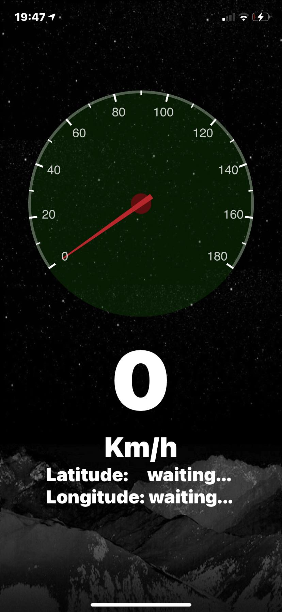

# The Gps Speedometer
# The purpose
I'm visually impaired and as so it's really anoying when I'm on the freeway and I can't see the speedometer. So I decided to create this app to, somewhat accurately, tell me how fast I'm going. I also spent some time to make it look cool :)
I might add some more functionality to it in the future, such as a settings tab to change the units of speed and font size, but for now it's just a simple speedometer.
I created the project using Expo and React Native because these are the tools I'm most familiar with for mobile development.

## Description
This is a simple speedometer app that uses the GPS sensor to calculate the speed of the device. It also shows the current location of the device in terms of latitude and longitude. The app displays the speed in big and bold text and also has a react-native-cool-speedometer :)

## Screenshots
Images with limited size:

